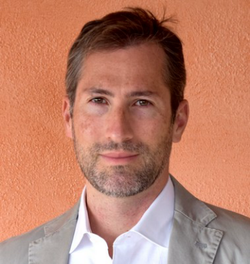

{ align=right }
[**Simone Aliprandi**](https://aliprandi.org/) è un avvocato, docente e divulgatore attivo nell'ambito della proprietà intellettuale e del diritto delle nuove tecnologie. Ha conseguito un dottorato di ricerca in Società dell'informazione (Università Milano Bicocca, 2012), un corso di perfezionamento in Data protection e Data governance (Università Milano Statale, 2018) e un corso di perfezionamento in Coding for lawyers e legal tech (Università Milano Statale, 2021).

Ha pubblicato varie monografie come "Creative Commons: manuale operativo" (2008), "Capire il copyright" (2012) e la più recente "Software licensing & data governance" (2020). Dal 2009 è parte del team di professionisti specializzati Array.eu e come avvocato si occupa principalmente di consulenza su contratti di cessione e gestione del copyright, trasferimento tecnologico, licenze, termini d'uso di piattaforme online e banche dati, privacy policy, tutela e registrazione di marchi e nomi a dominio, gestione dei beni culturali e archivistici. Dal 2010 collabora con la casa editrice milanese Ledizioni, per la quale coordina la collana "Copyleft-Italia". Dal 2019 è docente a contratto presso l'ISIA di Firenze e svolge costantemente attività di docenza in corsi di specializzazione e di aggiornamento professionale.
