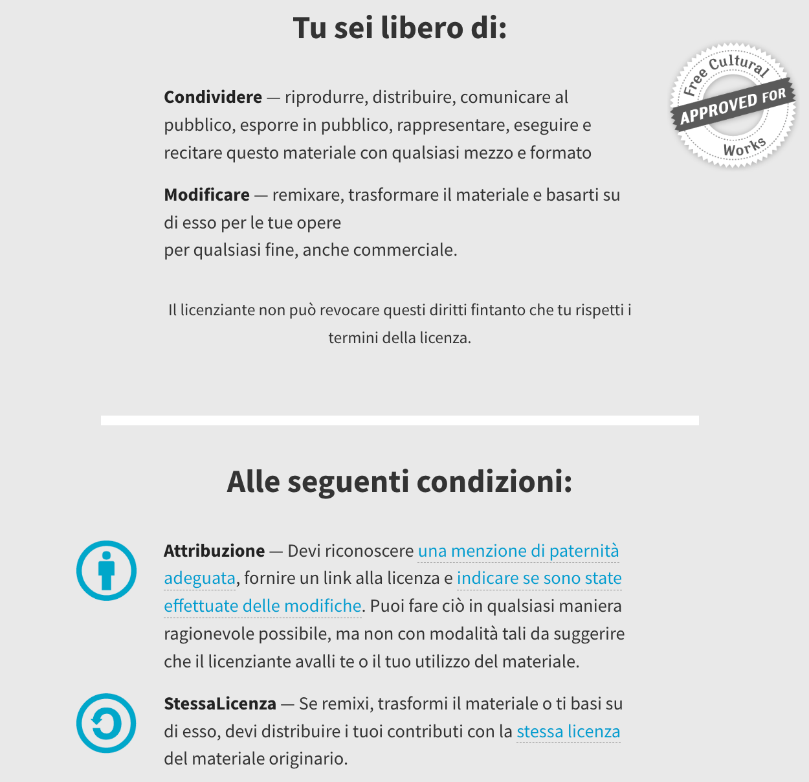
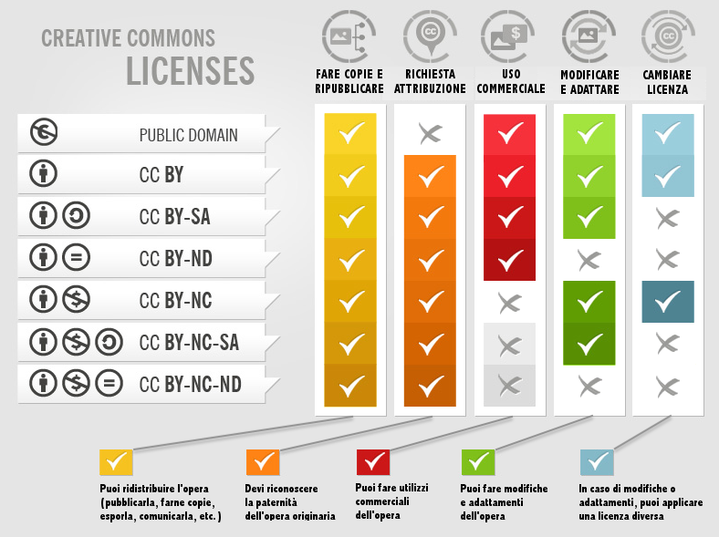
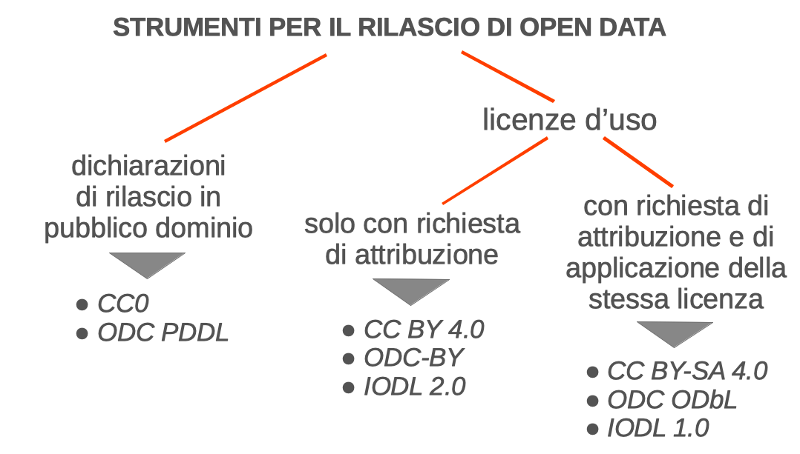

# 1\. Open data e diritto: tre diversi piani

Il fenomeno open data è trattato da tre branche del diritto che agiscono su tre piani diversi: il diritto della proprietà intellettuale, il diritto della privacy e del trattamento dei dati personali e il diritto amministrativo. Queste tre branche del diritto utilizzano categorie concettuali e terminologie diverse rendendo spesso poco lineare lo studio e la comprensione di questi temi per chi non ha una forma mentis giuridica e non ha confidenza con questi tre diversi piani.

## 1.1. Diritto della proprietà intellettuale

Il diritto della proprietà intellettuale pone le regole e i principi giuridici che governano il mondo della creatività: le opere dell'ingegno umano, il loro sfruttamento economico da parte dei creatori e degli aventi causa, il loro utilizzo da parte dei fruitori. Perciò il diritto della proprietà intellettuale si occupa dei dati sul piano della loro eventuale tutelabilità come opere dell'ingegno, dei limiti stabiliti dalla legge per il loro utilizzo, dei contratti per la cessione dei diritti e delle licenze d'uso. Il diritto della proprietà intellettuale coinvolge indistintamente le persone fisiche (esseri umani) e le persone giuridiche (società, associazioni, fondazioni, enti pubblici) che prendono parte, pur con ruoli diversi e con interessi opposti, al processo di progettazione, creazione, diffusione e fruizione di opere dell'ingegno.

  - Principali fonti normative a livello europeo: Direttiva 96/9/CE relativa alla tutela giuridica delle banche di dati; Direttiva 2001/29/CE sull'armonizzazione di taluni aspetti del diritto d'autore e dei diritti connessi nella società dell'informazione; Direttiva 2019/790/UE sul diritto d'autore e sui diritti connessi nel mercato unico digitale

  - Principali fonti normative a livello nazionale: Legge n. 633/1941 (Legge italiana sul diritto d'autore) con le varie modifiche sopraggiunte

## 1.2. Diritto della privacy

Il diritto della privacy pone le regole e i principi giuridici che mirano a tutelare la riservatezza delle persone fisiche (esseri umani) e più specificamente governa le attività di raccolta e trattamento dei dati riconducibili alle persone fisiche.

Dunque, nonostante siano spesso oggetto di sovrapposizione e confusione, si tratta di due branche del diritto ben distinte, che fanno due lavori diversi, che si muovono su terreni separati (pur con qualche limitata area di intersezione).

  - Principali fonti normative a livello europeo: Reg. UE 2016/679 Regolamento generale per la protezione dei dati (cosiddetto GDPR); le disposizioni regolamentari e le linee guida del Garante europeo della protezione dati personali.

  - Principali fonti normative a livello nazionale: Decreto legislativo n. 196/2003 (cosiddetto Codice Privacy) con successive modifiche; le disposizioni regolamentari e le linee guida dell'Autorità Garante italiana per la protezione dei dati personali.

## 1.3. Diritto amministrativo

A questi due "piani" si aggiunge quello del diritto amministrativo in tutti quei casi in cui gli open data hanno una matrice pubblica e sono raccolti, gestiti, diffusi e aggiornati da una pubblica amministrazione o comunque da un'istituzione che persegue interessi pubblici. In questo caso gli open data rientrano nel solco del più ampio concetto di open government, cioè di un approccio aperto, trasparente e innovativo alla gestione della "cosa pubblica".

Nell'ultimo decennio sono stati approvati vari testi normativi a livello sia europeo, sia nazionale, sia locale che stabiliscono specifici obblighi per le pubbliche amministrazioni affinché esse raccolgano e pubblichino dati con un approccio open; tuttavia sono ancora molte le occasioni in cui queste norme vengono ignorate o disapplicate.

  - Principali fonti normative a livello europeo: Direttiva 2003/98/CE relativa al riutilizzo dell'informazione del settore pubblico; Direttiva 2019/1024/UE relativa all'apertura dei dati e al riutilizzo dell'informazione del settore pubblico; Regolamento UE 2018/1807 relativo a un quadro applicabile alla libera circolazione dei dati non personali nell'Unione europea.

  - Principali fonti normative a livello nazionale: Decreto Legislativo 82/2005 (Codice dell'Amministrazione Digitale), Decreto Legislativo 33/2013 (Riordino della disciplina riguardante il diritto di accesso civico e gli obblighi di pubblicità, trasparenza e diffusione di informazioni da parte delle pubbliche amministrazioni), Linee Guida Nazionali AgID per la Valorizzazione del Patrimonio Informativo Pubblico.

## 1.4. Ricapitolando…

Ricapitolando (e semplificando molto) otteniamo un quadro di questo tipo.

1)  > Il piano del diritto della proprietà intellettuale entra in gioco quando si tratta di capire chi è il titolare dei diritti su un dataset, quali sono i limiti per l'utilizzo dei dati da parte dei fruitori, quali sono le licenze d'uso applicate ai vari dataset.

2)  > Il piano del diritto della privacy entra in gioco unicamente quando un dato è qualificabile come "personale" (cioè se un dato è riconducibile a una persona fisica) e di conseguenza quando utilizzare degli open data comporta anche un'attività di trattamento di dati personali, con applicazione delle norme sul trattamento dati personali (GDPR, Codice privacy, prassi e indicazioni del Garante Privacy).

3)  > Il piano del diritto amministrativo riguarda più in generale il mondo delle pubbliche amministrazioni ma anche i rapporti tra esse e i cittadini; da circa un paio di decenni il diritto amministrativo prevede anche un apparato di norme mirate a digitalizzare l'attività amministrativa e a renderla trasparente (qui rientrano anche le norme sugli open data).

Indubbiamente, tutti e tre i piani risultano fondamentali per inquadrare correttamente il fenomeno open data da un punto di vista giuridico.

# 2\. Dati in che senso?

## 2.1. Accezione comune vs accezione giuridica

Il linguaggio di norma usato in campo informatico spesso induce a creare confusione sul reale significato di "dati". C'è infatti la tendenza a parlare in senso generico di "dati" in riferimento a tutto il materiale memorizzabile su un supporto di memoria, indipendentemente che si tratti di film, brani musicali, documenti, immagini, file di altro tipo. In senso ancora più ampio e neutro il vocabolario online Treccani fornisce una definizione alquanto efficace: "Ciò che è immediatamente presente alla conoscenza, prima di ogni forma di elaborazione"\[1\].

Dal punto di vista del linguaggio giuridico "dati" ha una portata semantica più ristretta e si riferisce appunto solo alle singole e isolate informazioni, non organizzate e non elaborate dall'ingegno umano, dunque anche non sottoposte ad alcuna tutela e privativa diretta.

Concetto da tenere a sua volta distinto è quello di "banca dati" (con il suo equivalente inglese "database"); ne forniremo una più chiara definizione (in senso giuridico) nei paragrafi successivi.

Inoltre, se ci ricolleghiamo con quanto scritto nel paragrafo precedente, per non confondere i piani e non cadere in errori giuridico-concettuali è essenziale chiedersi sempre se abbiamo a che fare con dati personali o con dati non personali. Infatti, nel caso dei dati personali, dobbiamo tenere in considerazione e applicare anche la normativa in materia di privacy; nel caso dei dati non personali possiamo invece preoccuparci solo delle questioni in materia di proprietà intellettuale e diritto amministrativo.

## 2.2. Dati personali

Come già accennato, per capire se nell'ambito di un progetto open data è necessario tenere in considerazione anche le norme e i principi in materia di privacy, dobbiamo innanzitutto verificare se all'interno dei dataset raccolti, pubblicati o utilizzati vi siano dati qualificabili come dati personali, secondo la definizione fornita dalla legge.

Tale definizione si trova nell'articolo 4 (punto 1) del GDPR ed è una definizione davvero molto ampia. La riportiamo integralmente:

> *«È un dato personale qualsiasi informazione riguardante una persona fisica identificata o identificabile ("interessato"); si considera identificabile la persona fisica che può essere identificata, direttamente o indirettamente, con particolare riferimento a un identificativo come il nome, un numero di identificazione, dati relativi all'ubicazione, un identificativo online o a uno o più elementi caratteristici della sua identità fisica, fisiologica, genetica, psichica, economica, culturale o sociale».*

A complicare non poco la questione è l'avverbio "indirettamente" che compare nella definizione; una parola che da sola riesce a stendere un velo di foschia sulla definizione, la rende molto ampia ed elastica e obbliga l'interprete a interrogarsi di volta in volta se i dati che sta trattando siano riconducibili anche solo in modo indiretto a una persona fisica.

Ci sono infatti molti casi in cui il dato, preso singolarmente, fuori dal suo contesto e osservato superficialmente, appare privo di collegamenti con una persona fisica; ma, nel momento in cui contestualizzo e metto in relazione quel dato con altri dati presenti nello stesso dataset o anche in altre fonti connesse, esso torna nell'alveo della menzionata definizione di "dato personale" e quindi è sottoposto a tutte le cautele previste dalla normativa privacy (per approfondire questo aspetto, si rimanda alla lettura del Considerando n. 26 del GDPR)\[2\].

## 2.3. Dati non personali

Il concetto di dato non personale è deducibile "in negativo" da quello di dato personale. Tutti quei dati che non rientrano nella definizione di cui all'art. 4 del GDPR (e cioè non sono in alcun modo riconducibili a una persona fisica) sono considerati dati non personali e quindi liberi dai vincoli dettati dalla normativa privacy.

Benché, come abbiamo spiegato nel paragrafo precedente, possano esserci varie aree grigie in cui alcuni dati apparentemente non personali possono essere considerati personali poiché riconducibili indirettamente a una persona fisica, vi sono alcune categorie di dati che per loro natura sono indubbiamente non personali. Pensiamo ad esempio ai dati meteorologici, ai dati sismologici e geologici, ai dati relativi al traffico dei mezzi pubblici (orari, stazioni, aeroporti), ai dati relativi alla spesa pubblica, ai dati relativi all'andamento delle borse e delle valute.

# 3\. La proprietà intellettuale sui dati?

## 3.1. Introduzione

Secondo uno dei principi cardine del diritto della proprietà intellettuale, il diritto d'autore nasce laddove c'è uno sforzo creativo e questo sforzo creativo si estrinseca in un'opera dell'ingegno secondo la definizione fornita dagli articoli 1 e 2 della legge 633/1941. Se manca tale carattere creativo, mancano i presupposti per la tutelabilità dell'opera.

Dobbiamo tenere ben presente questo principio anche, anzi soprattutto, quando abbiamo a che fare con i dati; infatti alla luce di questo principio, un semplice dato, isolato e – come si usa dire in gergo – "crudo", non può essere oggetto di tutela; è di tutti e di nessuno.

Ciò nonostante uno dei principali problemi del fenomeno open data è proprio la gestione della proprietà intellettuale sui dati e delle relative licenze d'uso. Nei prossimi paragrafi capiremo meglio il senso di questa apparente contraddizione.

## 3.2. Dati… o più propriamente banche dati

Se i dati "sciolti" e "crudi" non sono soggetti a tutela, diversa è la situazione quando i dati sono raccolti e organizzati in banche dati (o database nell'accezione inglese); realizzare una banca dati è infatti un'attività che invece può richiedere uno sforzo creativo/intellettuale e un rilevante investimento.

Per definire in poche parole che cosa sia una banca dati (o database)\[3\], possiamo dire che è un insieme organizzato e strutturato di dati. Ma per maggior precisione, si veda la definizione fornita all'articolo 1.2 dalla direttiva n. 96/9/CE, che diventerà da qui in poi il principale riferimento per la nostra analisi:

> *«Ai fini della presente direttiva per "banca di dati" si intende una raccolta di opere, dati o altri elementi indipendenti sistematicamente o metodicamente disposti ed individualmente accessibili grazie a mezzi elettronici o in altro modo.»*

I contratti di cessione diritti e le licenze d'uso si riferiscono quindi sempre alle banche dati e non ai dati in sé. Può sembrare la tipica "questione di lana caprina" da giuristi, ma si tratta di una sfumatura concettuale fondamentale per capire buona parte delle riflessioni che faremo da qui in poi.

## 3.3. Il problema delle banche dati non creative e il cosiddetto diritto sui generis

Abbiamo detto che il diritto d'autore scatta nel momento in cui c'è attività creativa; tuttavia non tutte le banche dati sono davvero creative, cioè non tutte organizzano i dati secondo precise scelte creative/intellettuali. Molte infatti sono banche dati meramente compilative, cioè banche dati che raccolgono grandi masse di dati e li organizzano secondo criteri necessitati e – potremmo dire – "banali": in ordine numerico (dal più grande al più piccolo o viceversa), in ordine alfabetico, in ordine cronologico, secondo una divisione geografica (per regione, per provincia, per nazione). Un classico esempio di banca dati non creativa è il buon vecchio elenco telefonico, un librone cartaceo in cui si trovano numeri di telefono e indirizzi, disposti in ordine alfabetico e divisi per comune di residenza; un altro esempio sono gli orari dei treni o degli autobus. Buona parte degli open data diffusi in rete rientrano in questa definizione di banca dati non creativa (o come più comunemente si dice, di "dataset").

Benché non ci sia un vero e proprio carattere creativo, anche la realizzazione di queste banche dati e il loro aggiornamento costante richiedono un rilevante investimento. Come fare dunque a tutelare questo investimento se il diritto d'autore (inteso in senso classico) non può essere applicato a questo tipo di creazioni? La risposta a questo interrogativo è giunta dal legislatore europeo che nel 1996 ha adottato una direttiva sulla tutela delle banche dati (la 96/9/CE) creando un particolare sistema di tutela "a doppio strato" per le banche dati realizzate in UE. Nella direttiva si introduce infatti un nuovo diritto (chiamato "diritto sui generis" proprio per la sua singolarità) che tutela il costitutore di una banca dati non creativa la cui realizzazione abbia richiesto un rilevante investimento; il rilevante investimento diventa quindi il requisito fondante del diritto sui generis come il carattere creativo lo è per il diritto d'autore. Questo nuovo diritto riserva al costitutore la possibilità di autorizzare o inibire attività di estrazione e reimpiego di parti sostanziali di una banca dati e ha una durata di 15 anni dalla messa in commercio della banca dati (termine che si rinnova ad ogni attività di aggiornamento della banca dati).

## 3.4. Un sistema di tutela "a doppio strato"

Abbiamo parlato non a caso di "sistema a doppio strato" perché comunque le banche dati creative sottostanno sia alla tutela del diritto d'autore sia alla tutela del diritto sui generis, così come è illustrato in questa immagine.

*Figura 1: I due diversi livelli di tutela per le banche dati basati sul requisito del carattere creativo*

Ricapitolando quindi possiamo trovare le seguenti casistiche:

  - banche dati non creative che però hanno richiesto un rilevante investimento ⇨ sottoposte alla tutela del solo diritto sui generis ⇨ sono riservate le attività di estrazione e reimpiego di parti sostanziali della banca dati ⇨ 15 anni di tutela

  - banche dati creative che denotano un carattere creativo nell'organizzazione dei dati ⇨ sottoposte contemporaneamente alla tutela del diritto sui generis e alla tutela del diritto d'autore ⇨ sono riservate sia le attività di estrazione e reimpiego di parti sostanziali sia le attività normalmente coperte dal diritto d'autore ⇨ 70 anni di tutela

Il diritto sui generis è comunque sempre presente; e tra i due tipi di tutela è indubbiamente quello più invasivo e più problematico.

Conoscere questo particolare sistema di tutela previsto in UE per le banche dati (e ricordarsi che fuori dall'UE può essere sostanzialmente diverso) è fondamentale per comprendere il funzionamento delle licenze per dati e delle varie questioni connesse emergenti.

# 4\. Le licenze per dati aperti

## 4.1. Il concetto di licenza e il meccanismo del licensing

Innanzitutto dobbiamo capire che cos'è una licenza e qual è il meccanismo che vi sta dietro.

"Licenza" deriva dal latino "licere" che significa autorizzare; quindi una licenza è principalmente un documento con cui si concedono alcuni permessi per l'utilizzo di un'opera. A concedere questi permessi dev'essere (a rigor di logica) il titolare dei diritti, che assume il ruolo di licenziante. Dall'altro lato abbiamo invece l'utilizzatore dell'opera che assume il ruolo di licenziatario. Normalmente le licenze d'uso instaurano un rapporto contrattuale con cui il licenziante concede dei permessi al licenziatario richiedendo in cambio il rispetto di alcune condizioni. Queste due componenti (permessi concessi e condizioni imposte) sono tendenzialmente presenti in tutte le licenze d'uso e la distinzione è particolarmente visibile se guardiamo le licenze Creative Commons nella versione sintetica (cosiddetto "commons deed") che appunto presentano le due parti intitolate "tu sei libero di…" e "alle seguenti condizioni".

*Figura 2: Screenshot della licenza Creative Commons Attribution-ShareAlike 4.0 International, in versione "commons deed"*

## 4.2. Le licenze per banche dati

Ricollegandoci a quanto spiegato nei paragrafi precedenti, il fatto che in Unione Europea esista un particolare sistema di tutela per le banche dati comporta che una licenza d'uso per banche dati, per funzionare correttamente nel contesto europeo, debba tenerne conto e soprattutto debba gestire correttamente il diritto sui generis. Una licenza che non menzioni espressamente quel diritto e non consideri le sue peculiarità (principalmente il fatto che si riferisca alle attività esclusive di estrazione e riuso di parti sostanziali di banche dati) rischia di rimanere "monca", cioè parzialmente inefficace, dato che quel diritto non è correttamente licenziato.

Ne sanno qualcosa negli uffici californiani di Creative Commons; infatti, le prime versioni delle loro licenze (fino al 2013)\[4\] non avevano tenuto in debita considerazione questo aspetto ed è stato poi necessario adeguare le licenze onde evitare che venissero escluse dai vari progetti open data che in quegli anni stavano fiorendo in tutto il vecchio continente.

## 4.3. Le licenze open in generale

Le licenze possono essere suddivise in due macro categorie: licenze proprietarie e licenze open. Nelle licenze proprietarie le restrizioni imposte prevalgono (sia a livello quantitativo sia a livello di impatto) sulle libertà concesse; nelle licenze open invece avviene il contrario. Una licenza open quindi è uno strumento con cui il titolare dei diritti sceglie di diffondere la sua opera in un regime di copyright più elastico e più aperto, appunto.

Le prime licenze open sono comparse nell'ambito informatico, con il movimento del software libero. Da lì in poi il fenomeno si è allargato ad altri campi della creatività umana, fino ad arrivare a coprire anche le banche dati.

Anche il concetto di "open" presenta varie gradazioni e tra le varie licenze open ce ne sono alcune più aperte di altre. Benché ci siano definizioni e approcci differenti, tendenzialmente non vengono considerate aperte in senso pieno le licenze che impongono restrizioni sugli utilizzi commerciali.

Quindi, utilizzando come modello il set di licenze Creative Commons, dalle sette licenze disponibili (più propriamente sei licenze più un *waiver* di rilascio in pubblico dominio) restano indubbiamente escluse le tre licenze con la condizione "Non Commercial". Una simile sorte (con alcune eccezioni) spetta alle restrizioni sulle modifiche e sulla realizzazione di opere derivate.

Solo al fine di fornire una panoramica completa del set di licenze offerto da Creative Commons, riportiamo un'ottima infografica che permette anche di conoscere e comprendere facilmente gli effetti di ciascuna licenza.

*Figura 3: Ottima infografica (realizzata da Foter e tradotta in italiano da Simone Aliprandi) che riassume con efficacia il significato e le implicazioni giuridiche delle licenze Creative Commons.*\[5\]

## 4.4. Le licenze open data

Tra le sottocategorie delle licenze open troviamo le licenze open data, cioè licenze open adeguate o anche appositamente progettate per rilasciare banche dati in modalità aperta.

Con l'avvio a livello internazionale del dibattito sugli open data (all'inizio della decade 2010) ci si chiese quali fossero le licenze più adatte allo scopo e la scelta ricadde quasi istintivamente sulle licenze Creative Commons, che erano già molto conosciute e semplici da utilizzare.

Come già spiegato, però, provenendo dall'ordinamento statunitense e non considerando espressamente il diritto sui generis, quelle licenze non funzionavano correttamente in Europa per le banche dati. Si avviò quindi un iter di aggiornamento delle licenze CC che nel novembre 2013 portò alla pubblicazione della versione 4.0, dove finalmente compaiono specifiche clausole sul diritto sui generis. Nel frattempo comunque erano nate altre licenze appositamente pensate per gli open data, alcune su iniziativa dei governi o enti pubblici (es. la francese Licence Ouverte, la britannica Open Government Licence, l'italiana IODL), altre su iniziativa di enti privati (es. la ODC-ODbL e la ODC-Attribution del progetto Open Data Commons).

Oltre alle licenze vere e proprie abbiamo poi i "public domain waiver", cioè dichiarazioni da associare alle banche dati per renderle del tutto libere dal copyright e donarle al pubblico dominio. Si tratta di una scelta ben più radicale rispetto alle licenze, perché il titolare dei diritti rinuncia a tutti i diritti sull'opera fin da subito (compreso il diritto a essere menzionato come titolare originario) e quindi perde qualsivoglia controllo su di essa.

Possiamo comunque riassumere nella seguente infografica il quadro delle principali licenze coerenti con la definizione di open data. Come vedete, rimangono fuori le licenze che non consentono gli utilizzi commerciali e che non consentono le attività di modifica e integrazione delle banche dati.

*Figura 4: I principali strumenti giuridici per il rilascio di open data*

In sostanza abbiamo tre strade percorribili:

  - la strada del rilascio in pubblico dominio ⇨ scelta consigliabile per i dataset di matrice pubblica soggetti a obbligo di pubblicazione;

  - la strada del rilascio con licenza di mera attribuzione ⇨ scelta consigliabile sia per i dati di matrice pubblica sia per i dati di matrice privata);

  - la strada del rilascio con licenza di attribuzione con clausola di persistenza ("share alike" nel linguaggio di Creative Commons) ⇨ scelta da riservare a casi con specifiche esigenze.

## 4.5. Clausola "share alike" e problemi di compatibilità tra licenze open data

L'opzione delle licenze "share alike" andrebbe scelta solo in situazioni marginali poiché, dal momento che pone alcune restrizioni sulla realizzazione di banche dati derivate, rischia di creare problemi di compatibilità con altre licenze per tutti quei progetti che prevedono l'integrazione di dati provenienti da fonti diverse. E come sappiamo buona parte dei progetti open data hanno come comune denominatore proprio l'integrazione di dataset diversi.

Nel momento in cui si decide di applicare a una banca dati una licenza di quel tipo, bisogna essere consapevoli del fatto che tale scelta poi condizionerà "all'infinito" le attività di derivazione e integrazione sul database rilasciato e avrà ripercussioni di lungo periodo sui vari progetti che saranno interessati a riutilizzare e integrare quella banca dati. Essi infatti dovranno aderire a loro volta alla stessa licenza (o in alternativa dovranno contattare il titolare per ottenere un'autorizzazione specifica). Se quei progetti, per loro policy o per altre ragioni, non potessero utilizzare la licenza scelta, non potranno far altro che non integrare la banca dati con i loro dati; e quindi, in caso di ridistribuzione dei dati da parte loro, saranno costretti a tenere la banca dati separata con una separata indicazione di licenza.

I problemi di compatibilità tra le principali licenze open data, in particolare nel caso di licenze "share alike", sono ben rappresentati da questa tabella.

*Figura 5: Tabella di compatibilità tra le principali licenze open data, da cui emergono i problemi di compatibilità delle licenze con clausola share alike*\[6\]

## 4.6. Come applicare le licenze ai dataset

L'applicazione delle licenze open a opere digitali è molto semplice e si basa fondamentalmente sul link. I testi delle licenze sono resi pubblici sui siti ufficiali dei progetti che le hanno redatte e che le tengono aggiornate (il sito di Creative Commons, il sito di Open Knowledge Foundation, il sito di Free Software Foundation, etc.) e il licenziante non deve fare altro che diffondere la sua opera (testo, immagine, video, banca dati) indicando in modo chiaro e univoco un riferimento alla licenza applicata, con tanto di link che rimanda al testo. Da un punto di vista giuridico, ciò che risulta essenziale è che sia chiara e inequivocabile la volontà del licenziante di applicare quella specifica licenza alla sua opera; e che questa sua scelta sia conoscibile e verificabile da tutti gli utilizzatori/licenziatari.

In ottica di web semantico, è caldeggiato l'inserimento delle informazioni relative alla titolarità dei diritti e della licenza applicata anche a livello di metadati.

Se si vuole essere ancora più precisi e fornire un'informazione ancora più completa e inequivocabile, è possibile riportare integralmente il testo della licenza, ad esempio inserendolo in un'apposita sezione del nostro repository (che possiamo chiamare "license" o anche "copyright") o incorporando il file di testo nell'archivio compresso (ZIP, RAR) o nello shapefile.

# 5\. Il riutilizzo di dati e documenti delle pubbliche amministrazioni

## 5.1. Dati personali pubblicati dalle pubbliche amministrazioni

Le pubbliche amministrazioni raccolgono e gestiscono moltissimi dati, alcuni qualificabili come dati personali, altri invece come dati non personali.

Quindi, se decidiamo di prelevare dei dati di matrice pubblica per utilizzarli in un progetto open data, è necessario procedere innanzitutto a distinguere i dati non personali dai dati personali, applicando a questi ultimi tutte le cautele previste dalla normativa sulla privacy. Nel caso in cui sia necessario integrare dataset che contengono sia dati personali (anche indirettamente personali) sia dati non personali, sarà necessario passare prima da una anonimizzazione degli stessi; comunque è consigliabile tenere traccia dei vari passaggi in modo da poter sempre intervenire sui dati personali e rimuoverli anche dopo l'attività di integrazione con altri dati.

Inoltre, quando si tratta di riutilizzare dati personali pubblicati da una pubblica amministrazione, un equivoco molto diffuso è quello di pensare che, se un dato è stato reso pubblico, allora è anche liberamente utilizzabile da chiunque, perché – si pensa ingenuamente – è ormai diventato pubblico e conosciuto da tutti. La questione è in realtà più complessa.

Gli stessi dati personali possono essere legittimamente "trattati" e pubblicati da una pubblica amministrazione in virtù di una delle basi giuridiche stabilite dal GDPR (art. 6), mentre non possono essere prelevati e riutilizzati legittimamente da un altro soggetto il quale non può far leva sulle medesime basi giuridiche.

Per quanto riguarda invece i dati per loro natura non personali, dovremo preoccuparci unicamente dell'aspetto della proprietà intellettuale, secondo quanto spiegato in questi prossimi paragrafi.

## 5.2. Il diritto d'autore degli enti pubblici

Gli enti pubblici sono titolari di diritti d'autore? E in quali termini? Per rispondere a questa domanda dobbiamo fare riferimento a due norme della L. 633/1941 (legge italiana sul diritto d'autore): gli articoli 5 e 11.

Iniziamo dall'art. 11 in cui si conferma che gli enti pubblici sono titolari di diritto d'autore:

> *«Alle Amministrazioni dello Stato, alle Province ed ai Comuni spetta il diritto di autore sulle opere create e pubblicate sotto il loro nome ed a loro conto e spese. Lo stesso diritto spetta agli enti privati che non perseguano scopi di lucro, salvo diverso accordo con gli autori delle opere pubblicate, nonché alle accademie e agli altri enti pubblici culturali sulla raccolta dei loro atti e sulle loro pubblicazioni.»*

Questo principio comprende tutti i diritti normalmente contemplati dalla legge sul diritto d'autore, quindi anche il diritto sui generis del costitutore di banca dati (sempre a condizione che la realizzazione della banca dati abbia richiesto un rilevante investimento).

L'art. 5 invece esclude dal campo d'azione del diritto d'autore "i testi degli atti ufficiali dello Stato e delle pubbliche amministrazioni, sia italiane che straniere", che quindi diventano di pubblico dominio "by default". Si noti che la norma va interpretata in senso restrittivo; bisogna dunque limitarsi unicamente ai testi (escludendo quindi immagini, video, banche dati, software e altri tipi di contenuti) degli atti ufficiali, cioè quegli atti che sono esercizio della funzione amministrativa e del potere autoritativo (escludendo contenuti come brochure informative e divulgative, sezioni di siti web pubblici dedicate alle notizie e agli approfondimenti). Un tipico esempio di contenuti che ricadono pienamente sotto il dettato dell'art. 5 è rappresentato dai testi delle sentenze dei tribunali e delle corti, i quali, al netto dei dati personali che vanno comunque rimossi, sono fin da subito liberi dal copyright e di pubblico dominio.

Importante annotazione: non ha alcun senso aggiungere una licenza open (anche se la più libera disponibile) a contenuti già coperti dall'art. 5, in quanto appunto sono già in pubblico dominio ex lege. Anzi, aggiungervi una licenza rischia solo di creare ulteriore confusione; si può al massimo aggiungere un "public domain mark", cioè un disclaimer che appunto indichi espressamente lo status di contenuti in pubblico dominio.

## 5.3. I dati a pubblicazione obbligatoria

Una fetta consistente dei dati raccolti e messi a disposizione dei cittadini dalle pubbliche amministrazioni sono raccolti e pubblicati non per una "gentile concessione" della PA competente e nemmeno per una scelta strategica della stessa, ma perché quella PA è tenuta a farlo in virtù di un obbligo di legge; un obbligo che è sostenuto da specifiche sanzioni per le PA e per i loro dirigenti. Questo principio è stato via via rafforzato dalle varie direttive europee e leggi nazionali in materia di open government, trasparenza della PA e riutilizzo dell'informazione pubblica. Con il D.Lgs. n. 33/2013 (anche noto come "decreto trasparenza") e con il successivo D.Lgs. n. 97/2016 (anche noto come "decreto FOIA") sono stati individuati chiaramente i dati soggetti a pubblicazione obbligatoria, cioè dati che la PA è tenuta a pubblicare regolarmente.

A rigor di buon senso, quindi, su questi dati le restrizioni di proprietà intellettuale dovrebbero essere ridotte al minimo\[7\], applicando al massimo una licenza di mera attribuzione, se non addirittura azzerate con un rilascio in pubblico dominio (esempio: CC Zero).

## 5.4. La licenza suggerita dalla linee guida AGID

Le linee guida italiane in materia di open data pubblici (Linee guida nazionali per la valorizzazione del patrimonio informativo pubblico), chiamate a fornire un'indicazione tra le varie opzioni, esprimono nell'Azione n. 12 un'esplicita preferenza per la licenza Creative Commons Attribution 4.0 International. Si legge infatti:

> *«Si ritiene opportuno fare riferimento ad una licenza unica aperta, che garantisca libertà di riutilizzo, che sia internazionalmente riconosciuta e che consenta di attribuire la paternità dei dataset (attribuire la fonte). Pertanto, si suggerisce l'adozione generalizzata della licenza CC BY nella sua versione 4.0, presupponendo altresì l'attribuzione automatica di tale licenza nel caso di applicazione del principio "Open Data by default", espresso nelle disposizioni contenute nell'articolo 52 del CAD.»*

Come è noto, documenti come le linee guida non rappresentano norme cogenti ma piuttosto delle raccomandazioni (cosiddetta "soft law"); tuttavia, essendo emanate dall'amministrazione centrale (in questo caso, un'agenzia ministeriale) diventano un fondamentale riferimento da cui le pubbliche amministrazioni difficilmente possono discostarsi senza subire critiche e segnalazioni.

## 5.5. Il cosiddetto "open by default" (art. 52 CAD)

Il cosiddetto Decreto Crescita 2.0, convertito poi nella Legge 221/2012, ha introdotto all'articolo 52 del Codice Amministrazione Digitale quello che viene di solito definito "principio open by default sui dati e sui documenti della pubblica amministrazione". Al comma 2 della norma (intitolata "Accesso telematico e riutilizzo dei dati") si legge:

> *«I dati e i documenti che \[le pubbliche amministrazioni\] pubblicano, con qualsiasi modalità, senza l'espressa adozione di una licenza \[...\] si intendono rilasciati come dati di tipo aperto \[...\], ad eccezione dei casi in cui la pubblicazione riguardi dati personali.»*

Il comma rimanda alla definizione di "dato aperto" fornita all'articolo 1, comma 1, lettere l-bis) e l-ter), che è utile riportare:

> *«\[sono dati di tipo aperto\] dati di tipo aperto: i dati che presentano le seguenti caratteristiche: 1) sono disponibili secondo i termini di una licenza o di una previsione normativa che ne permetta l'utilizzo da parte di chiunque, anche per finalità commerciali, in formato disaggregato; 2) sono accessibili attraverso le tecnologie dell'informazione e della comunicazione, ivi comprese le reti telematiche pubbliche e private, in formati aperti ai sensi della lettera l-bis), sono adatti all'utilizzo automatico da parte di programmi per elaboratori e sono provvisti dei relativi metadati; 3) sono resi disponibili gratuitamente attraverso le tecnologie dell'informazione e della comunicazione, ivi comprese le reti telematiche pubbliche e private, oppure sono resi disponibili ai costi marginali sostenuti per la loro riproduzione e divulgazione.»*

Questo meccanismo è particolarmente contorto e rappresenta una soluzione di compromesso non certo ottimale\[8\]; tuttavia è un meccanismo ingegnoso che permette di sfruttare l'inerzia delle pubbliche amministrazioni le quali spesso, pur mettendo a disposizione sui loro siti web dati e documenti di interesse pubblico, non provvedono a corredarli di una licenza open. In virtù dell'articolo 52 cittadini, imprese e altre pubbliche amministrazioni possono di fatto utilizzare quei dati e documenti come se fossero "aperti" anche in mancanza di una licenza esplicita.

Si noti un risvolto non irrilevante: la norma parla di dati e di documenti, ponendo ulteriori questioni interpretative. Innanzitutto, introduce il concetto di "documenti" senza però fornirne una precisa definizione. Inoltre crea un disallineamento semantico con la terminologia della legge sul diritto d'autore in cui invece, come abbiamo spiegato, si parla principalmente di "banche dati" e non di "dati" (articoli 1 e 2) e di "atti ufficiali" e non di "documenti ufficiali" (articolo 5).

Ad ogni modo, al di là dei rilievi critici su questa scelta normativa non ottimale, nei fatti l'articolo 52 riesce a fornire un buon livello di libertà per gli utilizzatori di dati pubblici; quindi possiamo salutarlo come una norma utile e innovativa.

# Per approfondire

I contenuti della presente guida traggono parzialmente spunto da materiali già pubblicati (sia dello stesso autore, sia di altri autori) ai quali si rimanda per eventuali approfondimenti.

## Libri

  - Simone Aliprandi, *Software licensing & data governance. Tutelare e gestire le creazioni tecnologiche* (Apogeo/Feltrinelli, settembre 2020); disponibile liberamente qui: [https://aliprandi.org/books/software-licensing-data-governance/](https://aliprandi.org/books/software-licensing-data-governance/).

  - Simone Aliprandi, *Il fenomeno open data. Indicazioni e norme per un mondo di dati aperti* (Ledizioni, febbraio 2014); disponibile liberamente qui: [https://aliprandi.org/books/fenomeno-opendata/](https://aliprandi.org/books/fenomeno-opendata/).

  - Fernanda Faini, *Data Society. Governo dei dati e tutela dei diritti nell'era digitale* (Giuffrè Francis Lefebvre, 2019); non disponibile liberamente online.

  - Carlo Piana, *Open source, software libero e altre libertà. Un'introduzione alle libertà digitali* (Ledizioni, giugno 2018); disponibile liberamente qui: [https://www.slideshare.net/simonealiprandi/open-source-software-libero-e-altre-libert-libro-carlo-piana-2018](https://www.slideshare.net/simonealiprandi/open-source-software-libero-e-altre-libert-libro-carlo-piana-2018)

## Articoli

  - Simone Aliprandi, *Open data: serve una norma più chiara. L'open by default non funziona*, su *Techeconomy2030.it* (dicembre 2018); disponibile liberamente qui: [https://www.techeconomy2030.it/2018/12/28/open-data-serve-una-norma-piu-chiara-lopen-by-default-non-funziona/](https://www.techeconomy2030.it/2018/12/28/open-data-serve-una-norma-piu-chiara-lopen-by-default-non-funziona/).

  - Simone Aliprandi, *Open licensing e banche dati*, in *Informatica e diritto* (Fascicolo 1-2, 2011); disponibile liberamente qui: [http://aliprandi.blogspot.com/2013/02/open-licensing-e-banche-dati.html](http://aliprandi.blogspot.com/2013/02/open-licensing-e-banche-dati.html).

  - Federico Morando, *Interoperabilità giuridica: rendere i dati (pubblici) aperti compatibili con imprese e comunità online*, in *JLIS.it*, 4(1), gennaio 2013; disponibile liberamente qui: [https://doi.org/10.4403/jlis.it-5461](https://doi.org/10.4403/jlis.it-5461).

  - Maurizio Napolitano, Quale licenza per gli opendata? (la storia infinita), blogpost (maggio 2019); disponibile qui: [https://medium.com/open-data-stories/quale-licenza-per-gli-opendata-ea18a5ed592](https://medium.com/open-data-stories/quale-licenza-per-gli-opendata-ea18a5ed592d).

  - Monica Palmirani, Dino Girardi, Michele Martoni, Michela Rossi, Morena Ragone, Fernanda Faini, *Le licenze per il rilascio degli Open Data della Pubblica Amministrazione. Prime riflessioni alla luce dalla Direttiva UE 2019/1024*, in *DIMT.it* (novembre 2018); disponibile previa registrazione qui: [https://www.dimt.it/la-rivista/articoli/licenze-rilascio-open-data-pa/](https://www.dimt.it/la-rivista/articoli/licenze-rilascio-open-data-pa/).

## Altri documenti

  - AGID Agenzia per l'Italia digitale, *Linee guida nazionali per la valorizzazione del patrimonio informativo pubblico*, versione 2017; disponibile liberamente qui: [https://docs.italia.it/italia/daf/lg-patrimonio-pubblico/it/stabile/index.html](https://docs.italia.it/italia/daf/lg-patrimonio-pubblico/it/stabile/index.html).

  - Open Knowledge Foundation, *Open data handbook (versione italiana)*; disponibile liberamente qui: [http://opendatahandbook.org/guide/it/](http://opendatahandbook.org/guide/it/).

## Video

  - Simone Aliprandi, *Tre videopillole sugli open data*, brevi video divulgativi realizzati per OLOS – Fondazione Edulife (marzo 2022); disponibili liberamente qui: [https://aliprandi.blogspot.com/2022/03/tre-videopillole-opendata.html](https://aliprandi.blogspot.com/2022/03/tre-videopillole-opendata.html).

  - Simone Aliprandi, *Big data licensing*, webinar per il Corso di perfezionamento "Big data, artificial intelligence e piattaforme" dell'Università degli studi di Milano (giugno 2021); disponibile liberamente qui: [https://youtube.com/playlist?list=PLYoUkCOw\_SXhruS2wYpbYZMCH-yuNjItI](https://youtube.com/playlist?list=PLYoUkCOw_SXhruS2wYpbYZMCH-yuNjItI).

  - *Le licenze dei siti della pubblica amministrazione: Andrea Borruso intervista Simone Aliprandi*; video intervista (marzo 2012); disponibile liberamente qui: [https://www.youtube.com/watch?v=jcP20-5\_vSg](https://www.youtube.com/watch?v=jcP20-5_vSg).

  - Elena Giglia, *Perché serve la Open Science*, intervento alla Open Access Week del Politecnico di Torino (ottobre 2018); disponibile qui: [https://www.youtube.com/watch?v=H4XgQ3IMy5k](https://www.youtube.com/watch?v=H4XgQ3IMy5k).

**L'autore**

Simone Aliprandi è un avvocato, docente e divulgatore attivo nell'ambito della proprietà intellettuale e del diritto delle nuove tecnologie. Ha conseguito un dottorato di ricerca in Società dell'informazione (Università Milano Bicocca, 2012), un corso di perfezionamento in Data protection e Data governance (Università Milano Statale, 2018) e un corso di perfezionamento in Coding for lawyers e legal tech (Università Milano Statale, 2021).

Ha pubblicato varie monografie come "Creative Commons: manuale operativo" (2008), "Capire il copyright" (2012) e la più recente "Software licensing & data governance" (2020). Dal 2009 è parte del team di professionisti specializzati Array.eu e come avvocato si occupa principalmente di consulenza su contratti di cessione e gestione del copyright, trasferimento tecnologico, licenze, termini d'uso di piattaforme online e banche dati, privacy policy, tutela e registrazione di marchi e nomi a dominio, gestione dei beni culturali e archivistici. Dal 2010 collabora con la casa editrice milanese Ledizioni, per la quale coordina la collana "Copyleft-Italia". Dal 2019 è docente a contratto presso l'ISIA di Firenze e svolge costantemente attività di docenza in corsi di specializzazione e di aggiornamento professionale.

1.  [http://www.treccani.it/vocabolario/dato/](http://www.treccani.it/vocabolario/dato/).

2.  Riportiamo un estratto del Considerando 26 del GDPR: «Per stabilire l'identificabilità di una persona è opportuno considerare tutti i mezzi, come l'individuazione, di cui il titolare del trattamento o un terzo può ragionevolmente avvalersi per identificare detta persona fisica direttamente o indirettamente. Per accertare la ragionevole probabilità di utilizzo dei mezzi per identificare la persona fisica, si dovrebbe prendere in considerazione l'insieme dei fattori obiettivi, tra cui i costi e il tempo necessario per l'identificazione, tenendo conto sia delle tecnologie disponibili al momento del trattamento, sia degli sviluppi tecnologici. I principi di protezione dei dati non dovrebbero pertanto applicarsi a informazioni anonime, vale a dire informazioni che non si riferiscono a una persona fisica identificata o identificabile o a dati personali resi sufficientemente anonimi da impedire o da non consentire più l'identificazione dell'interessato.»

3.  Spesso in ambito informatico il termine "database" disorienta perché fa pensare al software che gestisce i dati e non alla banca dati sottostante; questa viene più comunemente chiamata "dataset". Ai fini di questo documento possiamo utilizzare "database" e "dataset" come sinonimi.

4.  Si veda il testo del comunicato in cui si annuncia l'uscita delle licenze 4.0: [https://creativecommons.org/2013/11/26/press-release-creative-commons-launches-version-4-0-of-its-license-suite/](https://creativecommons.org/2013/11/26/press-release-creative-commons-launches-version-4-0-of-its-license-suite/).

5.  L'immagine è disponibile anche su Wikimedia Commons ([https://commons.wikimedia.org/wiki/File:Creative\_Commons\_Licenses.png](https://commons.wikimedia.org/wiki/File:Creative_Commons_Licenses.png)) in versione leggermente modificata da altro autore. Essa è a sua volta tratta da un'infografica più ampia, disponibile sul blog ufficiale di Foter ([https://foter.com/blog/how-to-attribute-creative-commons-photos/](https://foter.com/blog/how-to-attribute-creative-commons-photos/)). L'opera è rilasciata con licenza Creative Commons Attribution-ShareAlike 3.0 Unported.

6.  Versione rielaborata da Andrea Mangiatordi del grafico che si trova nelle "Linee guida nazionali per la valorizzazione del patrimonio informativo pubblico", a sua volta tratto dalla tabella presente nell'articolo di Federico Morando "Interoperabilità giuridica: rendere i dati (pubblici) aperti compatibili con imprese e comunità online" (JLIS.it, gennaio 2013).

7.  Volendo andare a un livello ulteriore di analisi giuridica potremmo sollevare il seguente dubbio. Se una pubblica amministrazione è comunque obbligata a pubblicare dei dati, possiamo davvero dire che abbia effettuato un "rilevante investimento" per la realizzazione della banca dati? In altre parole, possiamo davvero parlare di "investimento" se la PA non ha fatto altro che ottemperare a un obbligo, per altro utilizzando risorse economiche che le vengono appositamente attribuite dalla legge? Il quesito sembra di natura puramente dottrinale, ma è invece determinante; perché se la risposta fosse negativa, potremmo arrivare a dire che, mancando il requisito del "rilevante investimento", viene meno anche il diritto sui generis (quanto meno sulle banche dati realizzate dalla PA in ossequio a un obbligo di legge). Di conseguenza, su quei dati non ci sarebbe bisogno di una licenza, né in alternativa di invocare l'open by default dell'articolo 52 Codice Amministrazione Digitale.

8.  La soluzione ottimale sarebbe un intervento che vada a modificare gli articoli 5 e 11 della legge sul diritto d'autore. Per approfondire, si rimanda alla lettura di "Open data: serve una norma più chiara. L'open by default non funziona" \[[https://www.techeconomy2030.it/2018/12/28/open-data-serve-una-norma-piu-chiara-lopen-by-default-non-funziona/](https://www.techeconomy2030.it/2018/12/28/open-data-serve-una-norma-piu-chiara-lopen-by-default-non-funziona/)\], articolo del 2018 che contiene anche una proposta di riforma per l'art. 5.
