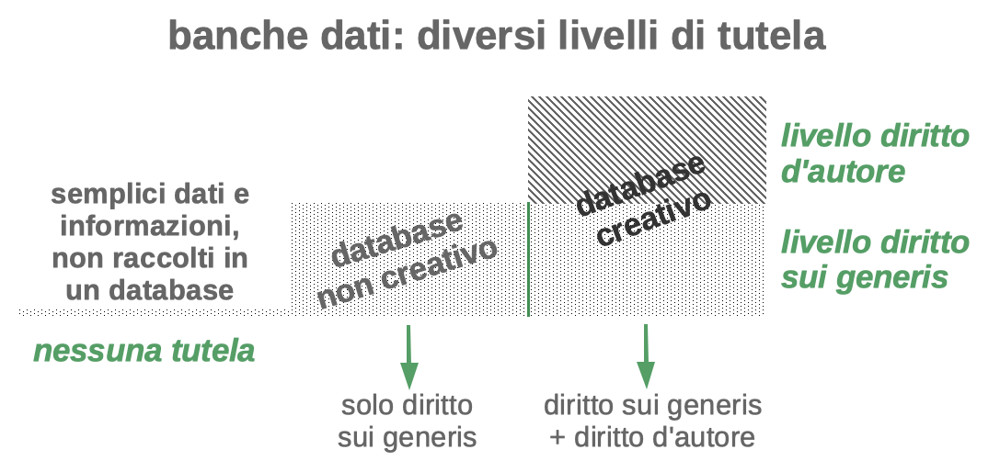

# La proprietà intellettuale sui dati?

## Introduzione

Secondo uno dei principi cardine del diritto della proprietà intellettuale, il diritto d'autore nasce laddove c'è uno sforzo creativo e questo sforzo creativo si estrinseca in un'opera dell'ingegno secondo la definizione fornita dagli articoli 1 e 2 della legge 633/1941. Se manca tale carattere creativo, mancano i presupposti per la tutelabilità dell'opera.

Dobbiamo tenere ben presente questo principio anche, anzi soprattutto, quando abbiamo a che fare con i dati; infatti alla luce di questo principio, un semplice dato, isolato e – come si usa dire in gergo – "crudo", non può essere oggetto di tutela; è di tutti e di nessuno.

Ciò nonostante uno dei principali problemi del fenomeno open data è proprio la gestione della proprietà intellettuale sui dati e delle relative licenze d'uso. Nei prossimi paragrafi capiremo meglio il senso di questa apparente contraddizione.

## Dati… o più propriamente banche dati

Se i dati "sciolti" e "crudi" non sono soggetti a tutela, diversa è la situazione quando i dati sono raccolti e organizzati in banche dati (o database nell'accezione inglese); realizzare una banca dati è infatti un'attività che invece può richiedere uno sforzo creativo/intellettuale e un rilevante investimento.

Per definire in poche parole che cosa sia una banca dati (o database)[^1], possiamo dire che è un insieme organizzato e strutturato di dati. Ma per maggior precisione, si veda la definizione fornita all'articolo 1.2 dalla direttiva n. 96/9/CE, che diventerà da qui in poi il principale riferimento per la nostra analisi:

> *«Ai fini della presente direttiva per "banca di dati" si intende una raccolta di opere, dati o altri elementi indipendenti sistematicamente o metodicamente disposti ed individualmente accessibili grazie a mezzi elettronici o in altro modo.»*

I contratti di cessione diritti e le licenze d'uso si riferiscono quindi sempre alle banche dati e non ai dati in sé. Può sembrare la tipica "questione di lana caprina" da giuristi, ma si tratta di una sfumatura concettuale fondamentale per capire buona parte delle riflessioni che faremo da qui in poi.

## Il problema delle banche dati non creative e il cosiddetto diritto sui generis

Abbiamo detto che il diritto d'autore scatta nel momento in cui c'è attività creativa; tuttavia non tutte le banche dati sono davvero creative, cioè non tutte organizzano i dati secondo precise scelte creative/intellettuali. Molte infatti sono banche dati meramente compilative, cioè banche dati che raccolgono grandi masse di dati e li organizzano secondo criteri necessitati e – potremmo dire – "banali": in ordine numerico (dal più grande al più piccolo o viceversa), in ordine alfabetico, in ordine cronologico, secondo una divisione geografica (per regione, per provincia, per nazione). Un classico esempio di banca dati non creativa è il buon vecchio elenco telefonico, un librone cartaceo in cui si trovano numeri di telefono e indirizzi, disposti in ordine alfabetico e divisi per comune di residenza; un altro esempio sono gli orari dei treni o degli autobus. Buona parte degli open data diffusi in rete rientrano in questa definizione di banca dati non creativa (o come più comunemente si dice, di "dataset").

Benché non ci sia un vero e proprio carattere creativo, anche la realizzazione di queste banche dati e il loro aggiornamento costante richiedono un rilevante investimento. Come fare dunque a tutelare questo investimento se il diritto d'autore (inteso in senso classico) non può essere applicato a questo tipo di creazioni? La risposta a questo interrogativo è giunta dal legislatore europeo che nel 1996 ha adottato una direttiva sulla tutela delle banche dati (la 96/9/CE) creando un particolare sistema di tutela "a doppio strato" per le banche dati realizzate in UE. Nella direttiva si introduce infatti un nuovo diritto (chiamato "diritto sui generis" proprio per la sua singolarità) che tutela il costitutore di una banca dati non creativa la cui realizzazione abbia richiesto un rilevante investimento; il rilevante investimento diventa quindi il requisito fondante del diritto sui generis come il carattere creativo lo è per il diritto d'autore. Questo nuovo diritto riserva al costitutore la possibilità di autorizzare o inibire attività di estrazione e reimpiego di parti sostanziali di una banca dati e ha una durata di 15 anni dalla messa in commercio della banca dati (termine che si rinnova ad ogni attività di aggiornamento della banca dati).

## Un sistema di tutela "a doppio strato"

Abbiamo parlato non a caso di "sistema a doppio strato" perché comunque le banche dati creative sottostanno sia alla tutela del diritto d'autore sia alla tutela del diritto sui generis, così come è illustrato in questa immagine.

*Figura 1: I due diversi livelli di tutela per le banche dati basati sul requisito del carattere creativo*

Ricapitolando quindi possiamo trovare le seguenti casistiche:

  - banche dati non creative che però hanno richiesto un rilevante investimento ⇨ sottoposte alla tutela del solo diritto sui generis ⇨ sono riservate le attività di estrazione e reimpiego di parti sostanziali della banca dati ⇨ 15 anni di tutela

  - banche dati creative che denotano un carattere creativo nell'organizzazione dei dati ⇨ sottoposte contemporaneamente alla tutela del diritto sui generis e alla tutela del diritto d'autore ⇨ sono riservate sia le attività di estrazione e reimpiego di parti sostanziali sia le attività normalmente coperte dal diritto d'autore ⇨ 70 anni di tutela

Il diritto sui generis è comunque sempre presente; e tra i due tipi di tutela è indubbiamente quello più invasivo e più problematico.

Conoscere questo particolare sistema di tutela previsto in UE per le banche dati (e ricordarsi che fuori dall'UE può essere sostanzialmente diverso) è fondamentale per comprendere il funzionamento delle licenze per dati e delle varie questioni connesse emergenti.

[^1]: Spesso in ambito informatico il termine "database" disorienta perché fa pensare al software che gestisce i dati e non alla banca dati sottostante; questa viene più comunemente chiamata "dataset". Ai fini di questo documento possiamo utilizzare "database" e "dataset" come sinonimi.
