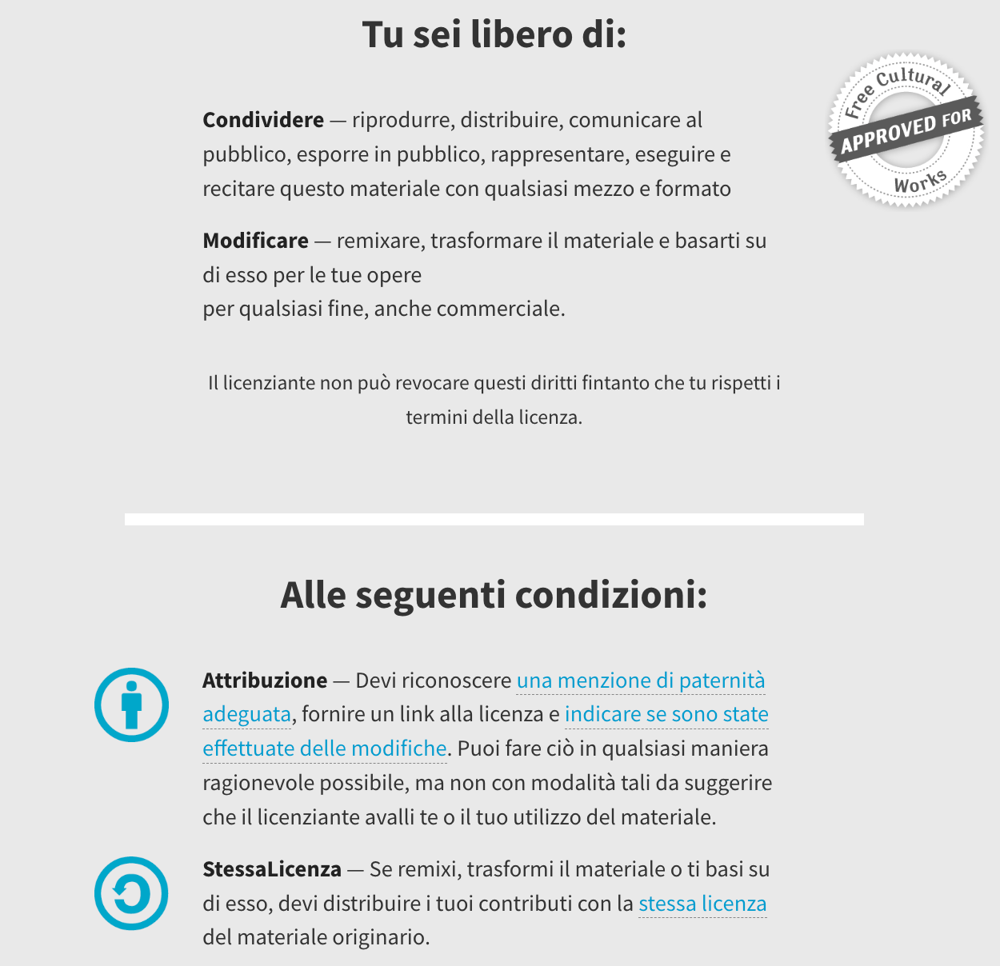
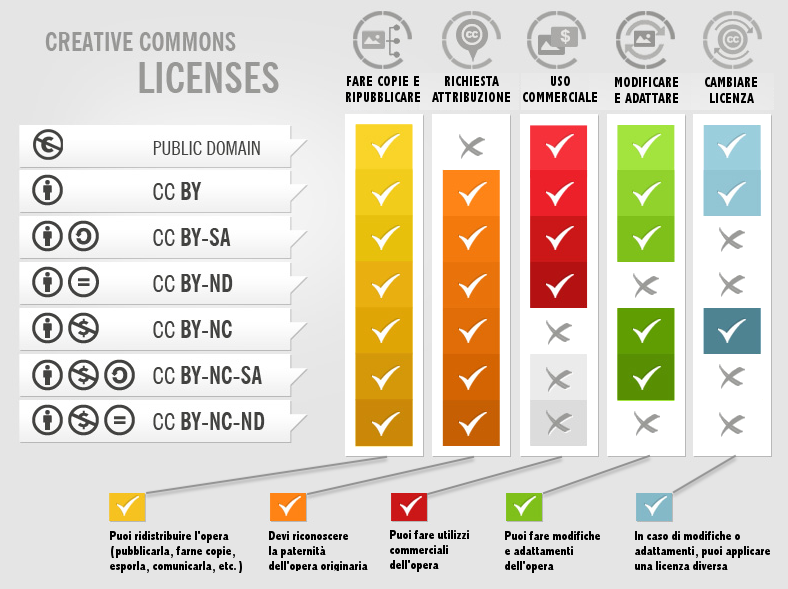
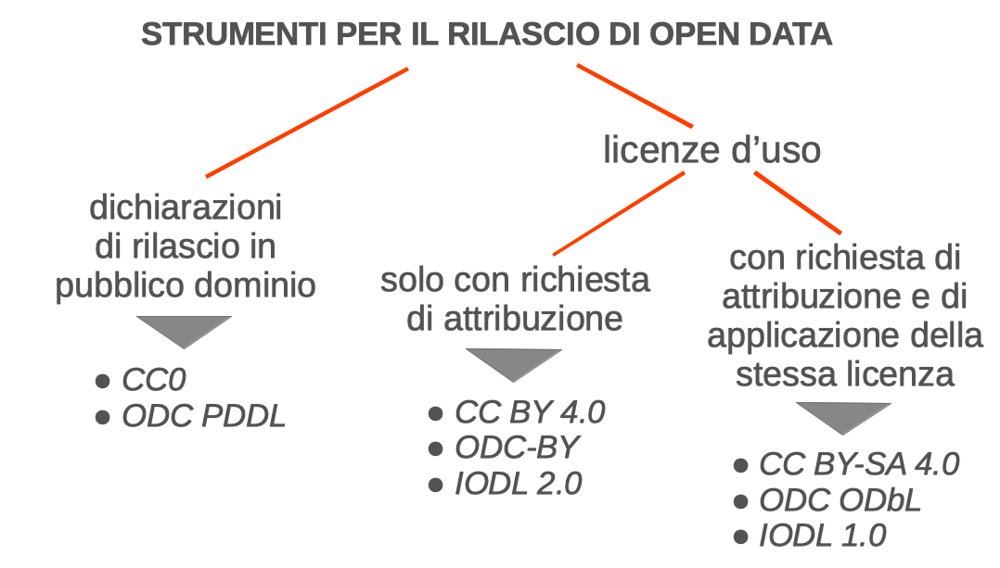
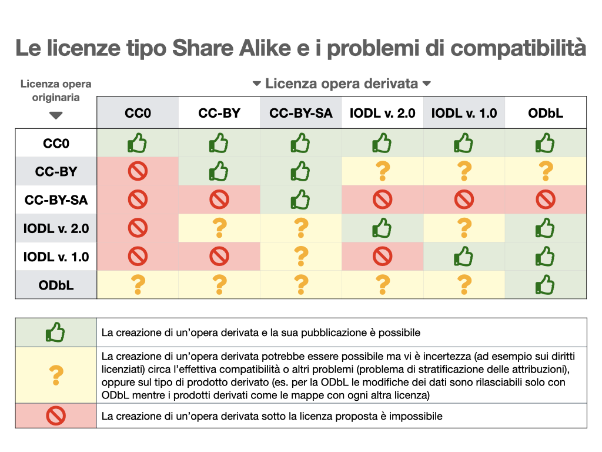

# Le licenze per dati aperti

## Il concetto di licenza e il meccanismo del licensing

Innanzitutto dobbiamo capire che cos'è una licenza e qual è il meccanismo che vi sta dietro.

"Licenza" deriva dal latino "licere" che significa autorizzare; quindi una licenza è principalmente un documento con cui si concedono alcuni permessi per l'utilizzo di un'opera. A concedere questi permessi dev'essere (a rigor di logica) il titolare dei diritti, che assume il ruolo di licenziante. Dall'altro lato abbiamo invece l'utilizzatore dell'opera che assume il ruolo di licenziatario. Normalmente le licenze d'uso instaurano un rapporto contrattuale con cui il licenziante concede dei permessi al licenziatario richiedendo in cambio il rispetto di alcune condizioni. Queste due componenti (permessi concessi e condizioni imposte) sono tendenzialmente presenti in tutte le licenze d'uso e la distinzione è particolarmente visibile se guardiamo le licenze Creative Commons nella versione sintetica (cosiddetto "commons deed") che appunto presentano le due parti intitolate "tu sei libero di…" e "alle seguenti condizioni".

*Screenshot della licenza Creative Commons Attribution-ShareAlike 4.0 International, in versione "commons deed"*

## Le licenze per banche dati

Ricollegandoci a quanto spiegato nei paragrafi precedenti, il fatto che in Unione Europea esista un particolare sistema di tutela per le banche dati comporta che una licenza d'uso per banche dati, per funzionare correttamente nel contesto europeo, debba tenerne conto e soprattutto debba gestire correttamente il diritto sui generis. Una licenza che non menzioni espressamente quel diritto e non consideri le sue peculiarità (principalmente il fatto che si riferisca alle attività esclusive di estrazione e riuso di parti sostanziali di banche dati) rischia di rimanere "monca", cioè parzialmente inefficace, dato che quel diritto non è correttamente licenziato.

Ne sanno qualcosa negli uffici californiani di Creative Commons; infatti, le prime versioni delle loro licenze (fino al 2013)[^1] non avevano tenuto in debita considerazione questo aspetto ed è stato poi necessario adeguare le licenze onde evitare che venissero escluse dai vari progetti open data che in quegli anni stavano fiorendo in tutto il vecchio continente.

## Le licenze open in generale

Le licenze possono essere suddivise in due macro categorie: licenze proprietarie e licenze open. Nelle licenze proprietarie le restrizioni imposte prevalgono (sia a livello quantitativo sia a livello di impatto) sulle libertà concesse; nelle licenze open invece avviene il contrario. Una licenza open quindi è uno strumento con cui il titolare dei diritti sceglie di diffondere la sua opera in un regime di copyright più elastico e più aperto, appunto.

Le prime licenze open sono comparse nell'ambito informatico, con il movimento del software libero. Da lì in poi il fenomeno si è allargato ad altri campi della creatività umana, fino ad arrivare a coprire anche le banche dati.

Anche il concetto di "open" presenta varie gradazioni e tra le varie licenze open ce ne sono alcune più aperte di altre. Benché ci siano definizioni e approcci differenti, tendenzialmente non vengono considerate aperte in senso pieno le licenze che impongono restrizioni sugli utilizzi commerciali.

Quindi, utilizzando come modello il set di licenze Creative Commons, dalle sette licenze disponibili (più propriamente sei licenze più un *waiver* di rilascio in pubblico dominio) restano indubbiamente escluse le tre licenze con la condizione "Non Commercial". Una simile sorte (con alcune eccezioni) spetta alle restrizioni sulle modifiche e sulla realizzazione di opere derivate.

Solo al fine di fornire una panoramica completa del set di licenze offerto da Creative Commons, riportiamo un'ottima infografica che permette anche di conoscere e comprendere facilmente gli effetti di ciascuna licenza.

*Ottima infografica (realizzata da Foter e tradotta in italiano da Simone Aliprandi) che riassume con efficacia il significato e le implicazioni giuridiche delle licenze Creative Commons.*[^2]

## Le licenze open data

Tra le sottocategorie delle licenze open troviamo le licenze open data, cioè licenze open adeguate o anche appositamente progettate per rilasciare banche dati in modalità aperta.

Con l'avvio a livello internazionale del dibattito sugli open data (all'inizio della decade 2010) ci si chiese quali fossero le licenze più adatte allo scopo e la scelta ricadde quasi istintivamente sulle licenze Creative Commons, che erano già molto conosciute e semplici da utilizzare.

Come già spiegato, però, provenendo dall'ordinamento statunitense e non considerando espressamente il diritto sui generis, quelle licenze non funzionavano correttamente in Europa per le banche dati. Si avviò quindi un iter di aggiornamento delle licenze CC che nel novembre 2013 portò alla pubblicazione della versione 4.0, dove finalmente compaiono specifiche clausole sul diritto sui generis. Nel frattempo comunque erano nate altre licenze appositamente pensate per gli open data, alcune su iniziativa dei governi o enti pubblici (es. la francese Licence Ouverte, la britannica Open Government Licence, l'italiana IODL), altre su iniziativa di enti privati (es. la ODC-ODbL e la ODC-Attribution del progetto Open Data Commons).

Oltre alle licenze vere e proprie abbiamo poi i "public domain waiver", cioè dichiarazioni da associare alle banche dati per renderle del tutto libere dal copyright e donarle al pubblico dominio. Si tratta di una scelta ben più radicale rispetto alle licenze, perché il titolare dei diritti rinuncia a tutti i diritti sull'opera fin da subito (compreso il diritto a essere menzionato come titolare originario) e quindi perde qualsivoglia controllo su di essa.

Possiamo comunque riassumere nella seguente infografica il quadro delle principali licenze coerenti con la definizione di open data. Come vedete, rimangono fuori le licenze che non consentono gli utilizzi commerciali e che non consentono le attività di modifica e integrazione delle banche dati.

*Figura 4: I principali strumenti giuridici per il rilascio di open data*

In sostanza abbiamo tre strade percorribili:

  - la strada del rilascio in pubblico dominio ⇨ scelta consigliabile per i dataset di matrice pubblica soggetti a obbligo di pubblicazione;

  - la strada del rilascio con licenza di mera attribuzione ⇨ scelta consigliabile sia per i dati di matrice pubblica sia per i dati di matrice privata);

  - la strada del rilascio con licenza di attribuzione con clausola di persistenza ("share alike" nel linguaggio di Creative Commons) ⇨ scelta da riservare a casi con specifiche esigenze.

## Clausola "share alike" e problemi di compatibilità tra licenze open data

L'opzione delle licenze "share alike" andrebbe scelta solo in situazioni marginali poiché, dal momento che pone alcune restrizioni sulla realizzazione di banche dati derivate, rischia di creare problemi di compatibilità con altre licenze per tutti quei progetti che prevedono l'integrazione di dati provenienti da fonti diverse. E come sappiamo buona parte dei progetti open data hanno come comune denominatore proprio l'integrazione di dataset diversi.

Nel momento in cui si decide di applicare a una banca dati una licenza di quel tipo, bisogna essere consapevoli del fatto che tale scelta poi condizionerà "all'infinito" le attività di derivazione e integrazione sul database rilasciato e avrà ripercussioni di lungo periodo sui vari progetti che saranno interessati a riutilizzare e integrare quella banca dati. Essi infatti dovranno aderire a loro volta alla stessa licenza (o in alternativa dovranno contattare il titolare per ottenere un'autorizzazione specifica). Se quei progetti, per loro policy o per altre ragioni, non potessero utilizzare la licenza scelta, non potranno far altro che non integrare la banca dati con i loro dati; e quindi, in caso di ridistribuzione dei dati da parte loro, saranno costretti a tenere la banca dati separata con una separata indicazione di licenza.

I problemi di compatibilità tra le principali licenze open data, in particolare nel caso di licenze "share alike", sono ben rappresentati da questa tabella.

*Tabella di compatibilità tra le principali licenze open data, da cui emergono i problemi di compatibilità delle licenze con clausola share alike*[^3]

## Come applicare le licenze ai dataset

L'applicazione delle licenze open a opere digitali è molto semplice e si basa fondamentalmente sul link. I testi delle licenze sono resi pubblici sui siti ufficiali dei progetti che le hanno redatte e che le tengono aggiornate (il sito di Creative Commons, il sito di Open Knowledge Foundation, il sito di Free Software Foundation, etc.) e il licenziante non deve fare altro che diffondere la sua opera (testo, immagine, video, banca dati) indicando in modo chiaro e univoco un riferimento alla licenza applicata, con tanto di link che rimanda al testo. Da un punto di vista giuridico, ciò che risulta essenziale è che sia chiara e inequivocabile la volontà del licenziante di applicare quella specifica licenza alla sua opera; e che questa sua scelta sia conoscibile e verificabile da tutti gli utilizzatori/licenziatari.

In ottica di web semantico, è caldeggiato l'inserimento delle informazioni relative alla titolarità dei diritti e della licenza applicata anche a livello di metadati.

Se si vuole essere ancora più precisi e fornire un'informazione ancora più completa e inequivocabile, è possibile riportare integralmente il testo della licenza, ad esempio inserendolo in un'apposita sezione del nostro repository (che possiamo chiamare "license" o anche "copyright") o incorporando il file di testo nell'archivio compresso (ZIP, RAR) o nello shapefile.

[^1]: Si veda il [testo del comunicato](https://creativecommons.org/2013/11/26/press-release-creative-commons-launches-version-4-0-of-its-license-suite/) in cui si annuncia l'uscita delle licenze 4.0.
[^2]: L'immagine è disponibile anche su [Wikimedia Commons](https://commons.wikimedia.org/wiki/File:Creative_Commons_Licenses.png) in versione leggermente modificata da altro autore. Essa è a sua volta tratta da un'infografica più ampia, disponibile sul [blog ufficiale di Foter](https://foter.com/blog/how-to-attribute-creative-commons-photos/). L'opera è rilasciata con licenza Creative Commons Attribution-ShareAlike 3.0 Unported.
[^3]: Versione rielaborata da Andrea Mangiatordi del grafico che si trova nelle "Linee guida nazionali per la valorizzazione del patrimonio informativo pubblico", a sua volta tratto dalla tabella presente nell'articolo di Federico Morando "Interoperabilità giuridica: rendere i dati (pubblici) aperti compatibili con imprese e comunità online" (JLIS.it, gennaio 2013).
